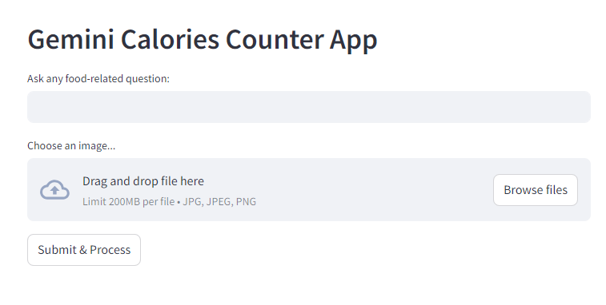
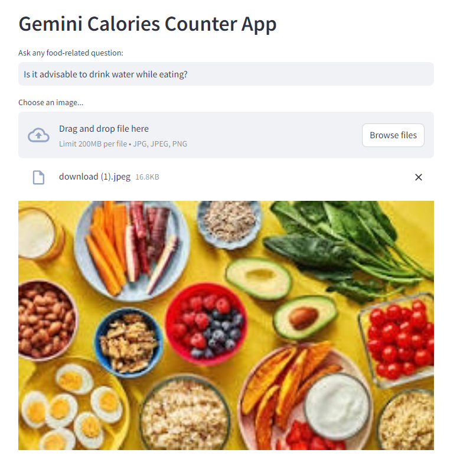
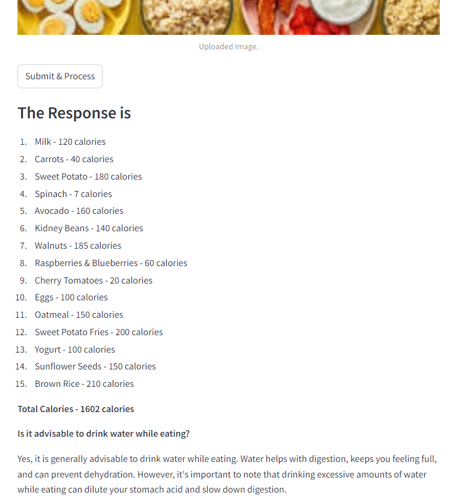

# Calories Counter Using Google's Gemini LLM


## Project Overview

 Sometimes you wonder the amount of calories consumed when you gulp down a plate containing a few of your favorite delicacies. Wouldn't it be wonderful if you could simply pass a picture of your plate through an app and get an estimate of the total number of calories before you decide how far in you want to dip? This calories counter can help you achieve this.
 Calories Counter is a Python application that uses Google's Gemini LLM to estimate the number of calories in food items. The app takes two inputs: a question about food and an image of the food or food items, or a plate of food. It outputs and answer to the question, the total number of calories in the image and a breakdown of calories by each food item in the image. The front end is built using Streamlit.


## Objectives

- To provide a tool that helps you count your calorie intake
- To leverage advanced AI technology for analyzing different food categories
- To offer a user-friendly interface that simplifies the calorie counting process.


## Features

- **Image Upload:** Users can upload an image of the food items or a plate of food.
- **Question Input:** Users can input any question about food or the uploaded image.
- **AI-Powered Analysis:** Utilizing Gemini AI, the application provides a detailed analysis of the image in the context of calories.
- **Calorie Estimation**: Provides the total number of calories in the given image.
- **Itemized Calorie Breakdown**: Lists the number of calories for each food item in the image.
- **Answer:** Provides an answer to the question asked
- **User-Friendly Interface**: Built with Streamlit, the app offers a clean and intuitive interface for users to interact with.


## Technologies Used

- **Streamlit:** For creating the web application interface.
- **Google Generative AI (Gemini-1.5-flash):** For processing and analyzing the image content.
- **Python:** The primary programming language used for backend development.
- **PDF2Image & PIL:** For handling PDF file conversions and image processing.


## Installation

1. Clone the repository:
    ```bash
    git clone https://github.com/mngembu/Calories-Counter-App-Using-Google-Gemini-LLP.git
    cd Calories-Counter-App
    ```

2. Create and activate a virtual environment:
    ```bash
    python -m venv env
    source env/bin/activate  # On Windows, use `env\Scripts\activate`
    ```

3. Install the required packages:
    ```bash
    python -m pip install -r requirements.txt
    ```

## Usage

1. Run the Streamlit app:
    ```bash
    streamlit run calories.py
    ```

2. Open your web browser and go to `http://localhost:8501`.

3. Upload an image of the food or plate of food, ask a question about the food, press Enter, then click the button, 'Submit & Process'.


## Dependencies

- Python 3.9+
- Streamlit
- google-generativeai
- python-dotenv
- PyPDF2


## Demo Images





## Challenges

- **Integration with Gemini AI:** Ensuring seamless communication between the Streamlit interface and Gemini AI model.
- **User Experience Optimization:** Designing an intuitive and responsive interface using Streamlit to ensure users could easily interact with the app was a key focus. Balancing simplicity with functionality required careful consideration of user feedback.


## Possible Future Enhancements

- **Enhanced Error Handling:** Improve the system's robustness in handling various file formats and user inputs. Currently. it only accepts .jpeg, .jpg, and .png.
- **Expanded Database:** Enhance the calorie database to include more regional and international food items for greater accuracy and inclusivity.
- **Nutritional Information:** Expand the app's functionality to provide additional nutritional information such as macronutrients, vitamins, and minerals.
- **Mobile Compatibility:** Develop a mobile version of the app to make it accessible to users on the go.


## Acknowledgements

- Thanks to Google's Gemini LLM for providing the foundational language model.
- Special thanks to Krish Naik for his resourceful teachings.

                                                       
## Contact

If you have any questions, feel free to reach out to me at ara.ngembu@yahoo.com.
- *Author: Mary Ara Ngembu*


 ### Happy calorie counting!

---


